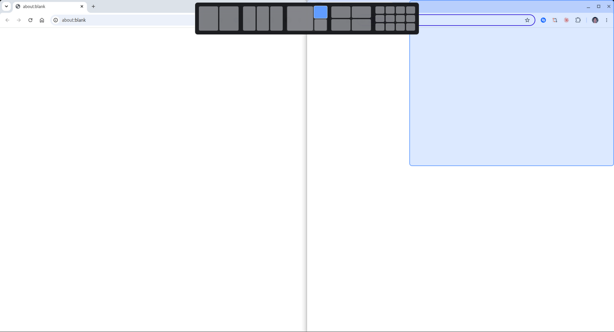
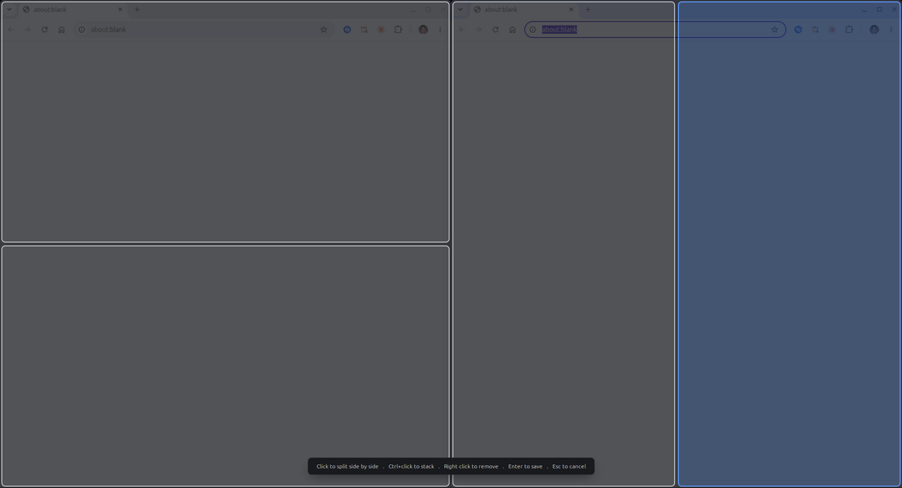

# tilo

Window tiling for Cinnamon that works the way Windows 11 snap layouts do, without installing half a desktop to get it.



## Why

Every tiling tool on Linux seems to ask for one of two things. Either you pull in a pile of dependencies and a background daemon, or you drop to a config file and restart your session to change a keybinding. Meanwhile Cinnamon ships with eight hardcoded snap zones and no way to add a ninth.

tilo is a Cinnamon extension. It is a folder of JavaScript that loads into the desktop process, which already runs a JavaScript engine whether you install anything or not. No daemon, no runtime, no compile step, nothing to add to your startup.

## Install

From source, for now:

```sh
git clone https://github.com/JeffreyGbeho/tilo
cd tilo
make install-user
```

Then enable it in **Settings > Extensions > Tilo**.

Packaging for apt is planned. Nothing is enabled automatically and no setting of yours is touched, so uninstalling is `make uninstall-user` and nothing else.

## Use it

**Drag a window toward the middle of the top edge.** A hint drops down, expands into the layout bar as you keep going, and highlights the zone under your pointer both on the thumbnail and full size on the screen. Let go to place the window.

**Press `Super+Z`** for the same picker without dragging.

## Draw your own zones



Press `Super+Shift+Z`. The screen becomes one zone. Click it to cut it side by
side, Ctrl+click to stack, right click to remove one. Enter saves the result as
a layout, Esc throws it away. Saved layouts show up in the picker next to the
built-in ones.

Layouts are stored as a split tree rather than a list of rectangles, which is
how KWin models its own tiling. Zones have no coordinates of their own, so they
cannot overlap, drift off screen, or leave a hole. Splitting is a local edit and
dragging a border is one number changing.

There is a button in the settings to delete every custom layout at once.

Or skip the picker entirely:

| Shortcut | |
| --- | --- |
| `Super+Ctrl+Left` | Left half |
| `Super+Ctrl+Right` | Right half |
| `Super+Ctrl+Up` | Top half |
| `Super+Ctrl+Down` | Bottom half |
| `Super+Ctrl+Enter` | Fill the screen |
| `Super+Ctrl+C` | Center |
| `Super+Z` | Layout picker |
| `Super+Shift+Z` | Zone editor |

Every one of them is rebindable in *Settings > Extensions > Tilo > Configure*, along with gaps and the distance from the top edge that reveals the bar. If you find the drag trigger intrusive, there is a switch to turn it off and keep the rest.

The defaults deliberately avoid `Super+arrows`, which belongs to Cinnamon's own snap. Nothing tilo binds by default was already taken by anything else on the system.

## It will not touch your settings

Plenty of extensions in this space overwrite desktop keybindings to make room for themselves and leave them broken after you uninstall. tilo does not write to `org.cinnamon.*` at all. Its own settings live in its own schema.

If a future feature ever needs to take over a key that belongs to Cinnamon, it goes through `ConfigGuard`: you opt in explicitly, the old value is recorded first, and it is put back when you turn the option off, disable the extension, or remove it.

## Known limits

Apps that declare resize increments, GNOME Terminal being the usual one, round their own size down to whole character cells. tilo puts them at the exact corner of the zone and the leftover, up to about 14px, falls to the bottom right. No window manager can override this. `make live-test` reports it separately from real failures for exactly that reason.

Everything else is X11 only for now, which is what Cinnamon 6.4 runs.

## Development

```sh
make dev-link     # symlink the source into the extension directory
make test         # offline harness
make live-test    # drive every open window through every action, for real
make restart      # restart Cinnamon, same as Ctrl+Alt+Escape
```

`make test` reproduces Cinnamon's module resolution rather than Node's, because the two disagree about relative paths and Node will happily pass code that Cinnamon refuses to load.

`make live-test` places every open window in every zone from every starting state and checks the result against the expected rectangle. It moves your windows around while it runs.

Logs are in *Settings > Extensions*, in the warnings tab, or `~/.xsession-errors`. `cinnamon-looking-glass` is the interactive debugger.

[docs/ARCHITECTURE.md](docs/ARCHITECTURE.md) covers the constraints this design answers, with source references. [docs/RESEARCH.md](docs/RESEARCH.md) is what people actually ask for from a tiling tool and what that implies.

## License

GPL-3.0
