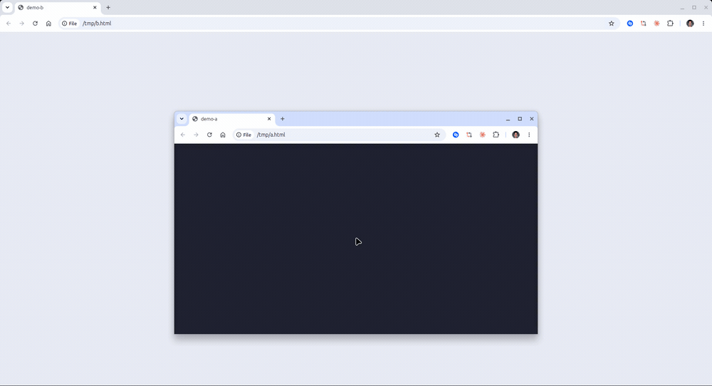
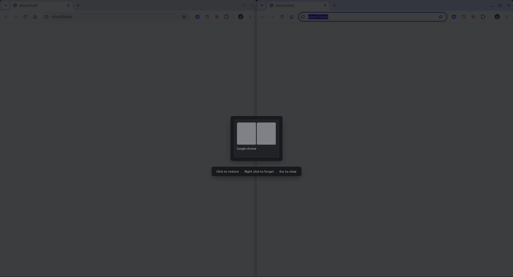

# tilo

Window tiling for Cinnamon that works the way Windows 11 snap layouts do, without installing half a desktop to get it.



## Why

Every tiling tool on Linux seems to ask for one of two things. Either you pull in a pile of dependencies and a background daemon, or you drop to a config file and restart your session to change a keybinding. Meanwhile Cinnamon ships with eight hardcoded snap zones and no way to add a ninth.

tilo is a Cinnamon extension. It is a folder of JavaScript that loads into the desktop process, which already runs a JavaScript engine whether you install anything or not. No daemon, no runtime, no compile step, nothing to add to your startup.

## Install

Add the repository once, then apt handles updates like anything else:

```sh
curl -fsSL https://jeffreygbeho.github.io/tilo/tilo-archive-keyring.gpg \
  | sudo tee /usr/share/keyrings/tilo-archive-keyring.gpg > /dev/null

echo "deb [signed-by=/usr/share/keyrings/tilo-archive-keyring.gpg] \
  https://jeffreygbeho.github.io/tilo stable main" \
  | sudo tee /etc/apt/sources.list.d/tilo.list

sudo apt update
sudo apt install tilo
```

Or grab the `.deb` from the [releases](https://github.com/JeffreyGbeho/tilo/releases):

```sh
sudo apt install ./tilo_0.4.0-1_all.deb
```

Or from source:

```sh
git clone https://github.com/JeffreyGbeho/tilo
cd tilo
make install-user
```

Whichever route, enable it in **Settings > Extensions > Tilo**.

The package installs files and does nothing else. It runs no maintainer script,
writes nothing to dconf, and does not enable itself, because a package running
as root has no business touching a user's settings. Removing it leaves your
configuration exactly as it was.

## Use it

**Drag a window toward the middle of the top edge.** A hint drops down, expands into the layout bar as you keep going, and highlights the zone under your pointer both on the thumbnail and full size on the screen. Let go to place the window.

**Press `Super+Z`** for the same picker without dragging.

## Draw your own zones


Press `Super+Shift+Z`. The screen becomes one zone. Click it to cut it side by
side, Ctrl+click to stack, right click to remove one. Enter saves the result as
a layout, Esc throws it away. Saved layouts show up in the picker next to the
built-in ones.

Layouts are stored as a split tree rather than a list of rectangles, which is
how KWin models its own tiling. Zones have no coordinates of their own, so they
cannot overlap, drift off screen, or leave a hole. Splitting is a local edit and
dragging a border is one number changing.

There is a button in the settings to delete every custom layout at once.

## Neighbours resize together

Drag the border between two tiled windows and both follow. Cinnamon used to do
this and lost it in the Mutter rebase, with nothing in the changelog. It is the
single feature people cite for sticking with plain edge snapping instead of a
zone tool, because without it a layout stops being a layout the moment you
adjust anything.

Because a layout is a tree, this is not edge detection and bookkeeping. The
border you dragged belongs to exactly one split, and moving it is that split's
weight changing. Everything else follows from laying the group out again.

## Save an arrangement, put it back later



Press `Super+G`. Save what is on screen, and restore it whenever you like:
tilo matches the saved slots against the windows you already have open, by
application and then by title, and puts each one back where it was.

This is the most requested feature in the whole category and close to unserved.
The GNOME shell issue asking for it is the highest voted of any tiling project,
KDE has had one open since 2023, and Windows 11 snap groups die when a single
member closes or you reboot.

tilo restores into the windows you already have rather than launching fresh
ones, which is the half that actually saves you time.

Or skip the picker entirely:

| Shortcut | |
| --- | --- |
| `Super+Ctrl+Left` | Left half |
| `Super+Ctrl+Right` | Right half |
| `Super+Ctrl+Up` | Top half |
| `Super+Ctrl+Down` | Bottom half |
| `Super+Ctrl+Enter` | Fill the screen |
| `Super+Ctrl+C` | Center |
| `Super+Z` | Layout picker |
| `Super+Shift+Z` | Zone editor |
| `Super+G` | Saved arrangements |

Every one of them is rebindable in *Settings > Extensions > Tilo > Configure*, along with gaps and the distance from the top edge that reveals the bar. If you find the drag trigger intrusive, there is a switch to turn it off and keep the rest.

The defaults deliberately avoid `Super+arrows`, which belongs to Cinnamon's own snap. Nothing tilo binds by default was already taken by anything else on the system.

## It will not touch your settings

Plenty of extensions in this space overwrite desktop keybindings to make room for themselves and leave them broken after you uninstall. tilo does not write to `org.cinnamon.*` at all. Its own settings live in its own schema.

If a future feature ever needs to take over a key that belongs to Cinnamon, it goes through `ConfigGuard`: you opt in explicitly, the old value is recorded first, and it is put back when you turn the option off, disable the extension, or remove it.

## Cost

Measured on the running desktop, during the whole gesture: a mean frame interval
of 9.1ms with nothing over 18ms and no dropped frames, against 8.6ms for the
same drag with the extension switched off. It adds 0.1MB, and runs no timer at
all unless a window is actually being dragged.

## Known limits

Apps that declare resize increments, GNOME Terminal being the usual one, round their own size down to whole character cells. tilo puts them at the exact corner of the zone and the leftover, up to about 14px, falls to the bottom right. No window manager can override this. `make live-test` reports it separately from real failures for exactly that reason.

Everything else is X11 only for now, which is what Cinnamon 6.4 runs.

## Development

```sh
make dev-link     # symlink the source into the extension directory
make test         # offline harness
make live-test    # drive every open window through every action, for real
make deb          # build the .deb into dist/
make apt-repo     # build a signed apt repository into public/
make restart      # restart Cinnamon, same as Ctrl+Alt+Escape
```

The `debian/` directory is the real source packaging, the kind a PPA or a Debian
sponsor builds from. `make deb` produces the same binary package using only
dpkg, so anyone who cloned the repository can build it without installing a
toolchain first.

`make test` reproduces Cinnamon's module resolution rather than Node's, because the two disagree about relative paths and Node will happily pass code that Cinnamon refuses to load.

`make live-test` places every open window in every zone from every starting state and checks the result against the expected rectangle. It moves your windows around while it runs.

Logs are in *Settings > Extensions*, in the warnings tab, or `~/.xsession-errors`. `cinnamon-looking-glass` is the interactive debugger.

[docs/PUBLISHING.md](docs/PUBLISHING.md) covers cutting a release and the route into Debian. [docs/ARCHITECTURE.md](docs/ARCHITECTURE.md) covers the constraints this design answers, with source references. [docs/RESEARCH.md](docs/RESEARCH.md) is what people actually ask for from a tiling tool and what that implies.

## License

GPL-3.0
